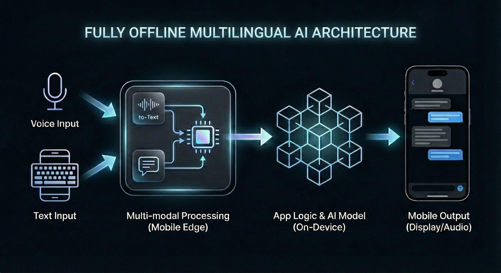

# SAHAY: AI for Inclusive Empowerment

**Bridging the Digital Divide with Offline, Multilingual Voice AI**

[](LICENSE)
[](https://www.android.com)
[](https://reactnative.dev)

## 📥 Download the App

<p align="center">
  <a href="https://drive.google.com/file/d/1MbSsTOClA-awWNQT5QApJL4hRu3t51bb/view?usp=drive_link">
    
  </a>
</p>

<p align="center">
  <strong>Version 1.0</strong> • <strong>Size: ~120 MB</strong> • <strong>Requires Android 7.0+</strong>
</p>

> **Note:** Since this app is not from the Play Store, you'll need to enable "Install from Unknown Sources" in your Android settings.

## 📋 Table of Contents

- [Introduction](#introduction)
- [Features](#features)
- [Technology Stack](#technology-stack)
- [System Architecture](#system-architecture)
- [Installation Guide](#installation-guide)
- [Data Model and Storage](#data-model-and-storage)
- [AI/ML Components](#aiml-components)
- [Security & Compliance](#security--compliance)
- [Scalability & Performance](#scalability--performance)
- [Repository & Demo](#repository--demo)
- [Contributing](#contributing)
- [License](#license)

## 🌟 Introduction

Across India, rural and low-income communities still face barriers in accessing AI-powered support for education, healthcare, and fraud awareness due to language limitations, low digital literacy, and poor connectivity. To bridge this divide, our solution introduces an inclusive, voice-based AI platform that understands and responds in multiple regional languages, ensuring culturally relevant and easy-to-understand guidance.

Built with quantized offline generative AI models, it works smoothly on low-cost devices without requiring constant internet access. The system helps users learn better through clear explanations, promotes safe health decisions, and empowers them to identify scams and access trusted channels.

Designed with human-centric principles, it prioritizes privacy, unbiased responses, and transparent communication. By partnering with NGOs, schools, and health centers, the platform aims to drive measurable impact through increased awareness, improved decision-making, and consistent usage in real-world, low-connectivity environments, bringing equitable AI access to communities that need it most.

## ✨ Features

- 🎤 **Voice-First Interface**: Natural voice interaction in multiple Indian languages
- 🌐 **Multilingual Support**: English, Hindi, Malayalam, and Kannada
- 📱 **Offline-First**: Works completely without internet connectivity
- 🔒 **Privacy-Focused**: All data stays on device, no cloud storage
- 💡 **Multiple Domains**: Education, Healthcare, Legal Aid, and Frontline Worker Support
- 📲 **Low-Resource Optimized**: Runs on devices with 4GB RAM
- ♿ **Accessible Design**: High-contrast UI, minimal text, large touch elements

## 🛠 Technology Stack
>
### Frontend
- **React Native + TypeScript**: Optimized for Android 7+ devices
- Lightweight, responsive UI with accessible layouts
- Large touch elements and simple flow for low-literacy users

### Offline AI Engine
- **Sarvam-1 LLM (Q8 Quantized)**: Multilingual, India-focused LLM running entirely on-device
- **Whisper Large v3 Turbo (Q5 Quantized)**: Accurate speech-to-text for multiple Indian languages

### Storage, Libraries & Tooling
- **Local JSON File System**: All data stored locally for privacy
- **llama.rn**: Optimized on-device LLM inference
- **whisper.rn**: Efficient speech-to-text processing
- **RNFS**: File-system operations for model and chat management

## 🏗 System Architecture
>
Sahay follows a fully offline, modular system architecture designed to deliver multilingual AI assistance directly on the mobile device without relying on cloud connectivity.

### Architecture Layers

1. **UI Layer**: Accessible interface in 4 languages (English, Hindi, Malayalam, Kannada) supporting voice and text interaction
2. **Logic Layer**: Dedicated services for AI operations
   - `LLMService`: Text generation
   - `WhisperService`: Speech-to-text conversion
   - `ChatHistoryService`: Conversation management
3. **Native Layer**: High-performance execution via llama.rn and whisper.rn
4. **Storage Layer**: Secure JSON-based file system maintaining all data on-device

All computation occurs locally, ensuring complete privacy, zero data leakage, and reliable performance in low-connectivity regions.



## 📦 Installation Guide

### Prerequisites

- **Operating System**: Windows/macOS/Linux
- **Android Device**: Android 7.0 (API 24) or higher
- **RAM**: Minimum 4GB on target device
- **Storage**: 4GB free space on device
- **Development Tools**:
  - Node.js 18+ and npm/yarn
  - React Native CLI
  - Android Studio with Android SDK
  - JDK 17

### Step 1: Clone the Repository

```bash
git clone https://github.com/Sreyas62/Sahay.git
cd Sahay
```

### Step 2: Install Dependencies

```bash
# Install npm dependencies
npm install

# Or using yarn
yarn install

# Install iOS dependencies (macOS only)
cd ios && pod install && cd ..
```

### Step 3: Run on Android

```bash
# Start Metro bundler
npm start

# In a new terminal, run on Android
npm run android

# Or using yarn
yarn android
```

### Step 6: Build for Production

```bash
# Android Release Build
cd android
./gradlew assembleRelease

# The APK will be available at:
# android/app/build/outputs/apk/release/app-release.apk
```

### Troubleshooting

- **Build Errors**: Clear cache with `npm start --reset-cache`
- **Gradle Issues**: Clean build with `cd android && ./gradlew clean`
- **Permission Issues**: Grant microphone and storage permissions

## 💾 Data Model and Storage
>
Sahay's data model and storage system are lightweight, private, and fully optimized for offline mobile use.

### Storage Architecture

- **Domain-Specific JSON Files**: Separate files for each service domain
  - Health
  - Education
  - Legal
  - General Assistance
  - Frontline Worker Support

### Key Features

- **Auto-Pruning**: Limits each service history to 50 chats, automatically deleting oldest entries
- **Optimized Performance**: Reduces read/write overhead for low-end devices
- **Local-Only**: No cloud backups, servers, or external synchronization
- **Privacy-First**: All data remains on user's device ensuring complete ownership

This approach ensures predictable storage usage even on devices with limited memory while maintaining recent conversation context.

## 🤖 AI/ML/Automation Components
>
Sahay's intelligence layer operates fully on-device, combining multilingual understanding, speech processing, and optimized model execution.

### Core Models

- **Sarvam-1 (Q8)**: Primary LLM for text generation
  - Optimized via llama.rn for low-latency inference
  - Handles reasoning, summarization, and response generation
  - Runs within 3GB RAM footprint
  
- **Whisper Large v3 Turbo (Q5)**: Speech-to-text engine
  - Accurate multilingual transcription
  - Works in noisy environments
  - Optimized for on-device processing

### Automated Features

- ✅ Voice-to-text conversion
- ✅ Automatic language detection and routing
- ✅ Domain-adaptive responses (health, education, legal, frontline)
- ✅ Automatic chat history pruning
- ✅ Memory-mapped execution with integer quantization

All AI components function completely offline after initial setup, ensuring privacy and consistent performance in low-connectivity regions.

## 🔒 Security & Compliance
>
### Privacy-First Design

- **100% On-Device Processing**: All AI inference and storage happens locally
- **Zero External Communication**: No user accounts, login, telemetry, or backend servers
- **Complete Anonymity**: No personal data collection or tracking
- **Data Ownership**: Users maintain full control over their data

### Regulatory Compliance

- ✅ **GDPR Compliant**: Data minimization and user autonomy
- ✅ **Indian IT Act Aligned**: Follows national privacy guidelines
- ✅ **Transparent Operations**: No hidden data collection

### Accessibility

- High-contrast UI for visual impairment
- Voice-first interaction for low literacy
- Minimal text reliance

### Permissions

**Required Permissions:**
- 🎤 Microphone: Voice input
- 💾 Storage: Model files and chat history

**No Additional Permissions**: No location, contacts, camera, or network access required

## ⚡ Scalability & Performance
>
### Device Requirements

- **Minimum RAM**: 4GB
- **Storage**: 4GB free space
- **Platform**: Android 7.0+ (API 24)
- **Network**: Only for initial downloading of the LLM

### Performance Metrics

- **LLM Generation**: 5-8 tokens/second
- **Speech-to-Text**: 2-4× real-time speed
- **Uptime**: 99.9% (unaffected by network issues)
- **Response Latency**: Sub-second for most queries

### Scalability Features

- **Language Expansion**: Easy addition of new Indian languages
- **Domain Extension**: Modular architecture supports new service areas
  - Agriculture
  - Women's Safety
  - Digital Literacy
  - Financial Inclusion
- **Model Flexibility**: Swap models for different device capabilities
- **Future-Proof**: Can adopt larger models as hardware improves

The modular design ensures long-term sustainability and continuous growth while maintaining strong performance across diverse devices.

## 🔗 Repository & Demo

- **Code**: [https://github.com/Sreyas62/Sahay](https://github.com/Sreyas62/Sahay)
- **Demo Video**: [https://drive.google.com/file/d/1vk_QMVeyoZhgxzxM7TBp30P4w28kafUH/view?usp=drivesdk](https://drive.google.com/file/d/1vk_QMVeyoZhgxzxM7TBp30P4w28kafUH/view?usp=drivesdk)

## 🤝 Contributing

We welcome contributions from the community! Please read our contributing guidelines before submitting pull requests.

### Areas for Contribution

- 🌐 Additional language support
- 🎨 UI/UX improvements
- 🐛 Bug fixes and performance optimization
- 📚 Documentation enhancements
- 🧪 Testing and quality assurance

## 📧 Contact & Support

For questions, feedback, or support, please open an issue on GitHub or contact the maintainers.

---

**Built with ❤️ for inclusive AI access across India**
